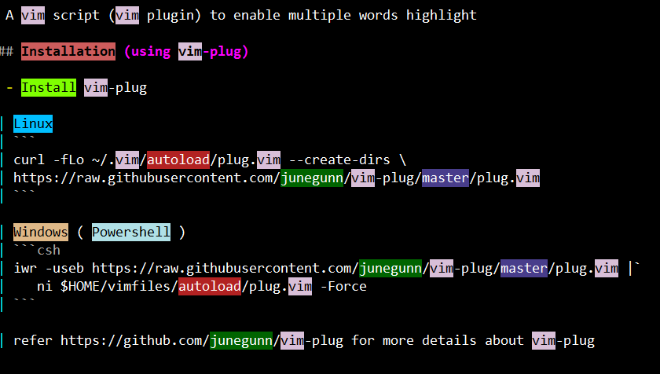

# multi_hl

 A vim script (vim plugin) to enable multiple words highlight

 - Screenshot

	

## Installation (using vim-plug)

 - Install vim-plug

	Linux
	```
	curl -fLo ~/.vim/autoload/plug.vim --create-dirs \
	https://raw.githubusercontent.com/junegunn/vim-plug/master/plug.vim
	```

	Windows ( Powershell )
	```csh
	iwr -useb https://raw.githubusercontent.com/junegunn/vim-plug/master/plug.vim |`
	   ni $HOME/vimfiles/autoload/plug.vim -Force
	```

	refer https://github.com/junegunn/vim-plug for more details about vim-plug


 - Add following lines in your .vimrc

	```
	call plug#begin('~/.vim/plugged')
	Plug 'juehyun/multi_hl'
	call plug#end()
	```


 - Open gvim and type following command
	```
	:PlugInstall
	```

## Usage

 - Refer the URL(https://vim.fandom.com/wiki/Highlight_multiple_words) for the usage

 - This vim script file come from the above URL and only the 'hot-key' and 'color' is changed


## Changes

 - Hot-keys

   | original hot-key | changed hot-key    | description                                                                                                       |
   | ---------------- | ------------------ | ----------------------------------                                                                                |
   | Keypad 0         | \0                 | search pattern(word under cursor or visual selected region) and clear the highlight, i.e. clear current highlight |
   | Keypad 1         | \1                 | search pattern(word under cursor or visual selected region) and set highlight using '1' color (of highlight.csv)  |
   | Keypad 2         | \2                 | ...                                                                                                               |
   | Keypad 3         | \3                 | ...                                                                                                               |
   | Keypad 4         | \4                 | ...                                                                                                               |
   | Keypad 5         | \5                 | ...                                                                                                               |
   | Keypad 6         | \6                 | ...                                                                                                               |
   | Keypad 7         | \7                 | ...                                                                                                               |
   | Keypad 8         | \8                 | ...                                                                                                               |
   | Keypad 9         | \9                 | ...                                                                                                               |
   | Keypad +         | \\=                | retrieve previous highlights                                                                                      |
   | Keypad -         | \\-                | save current highlights and clear all highlights                                                                  |
   | Keypad *         | \\\                | ...                                                                                                               |
   | \m               | \m                 | toggle enable/disable script                                                                                      |

	 Actually the '\m' key mapping is not needed because the script and hot-key mappings are enabled at startup
  

 - Color

	The colors for highlight pattern are changed

